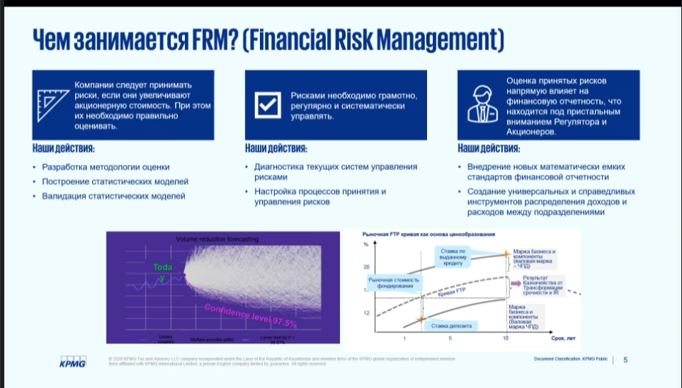
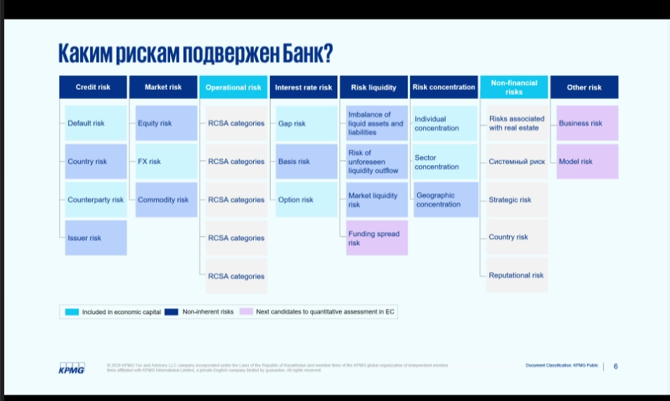
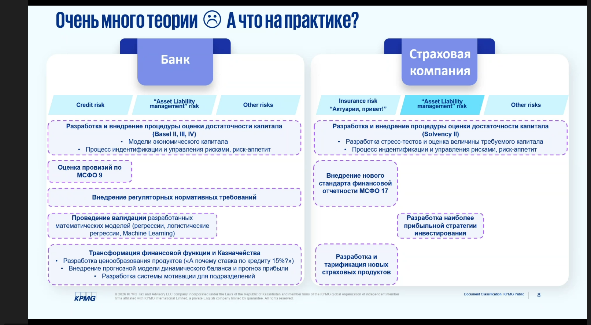
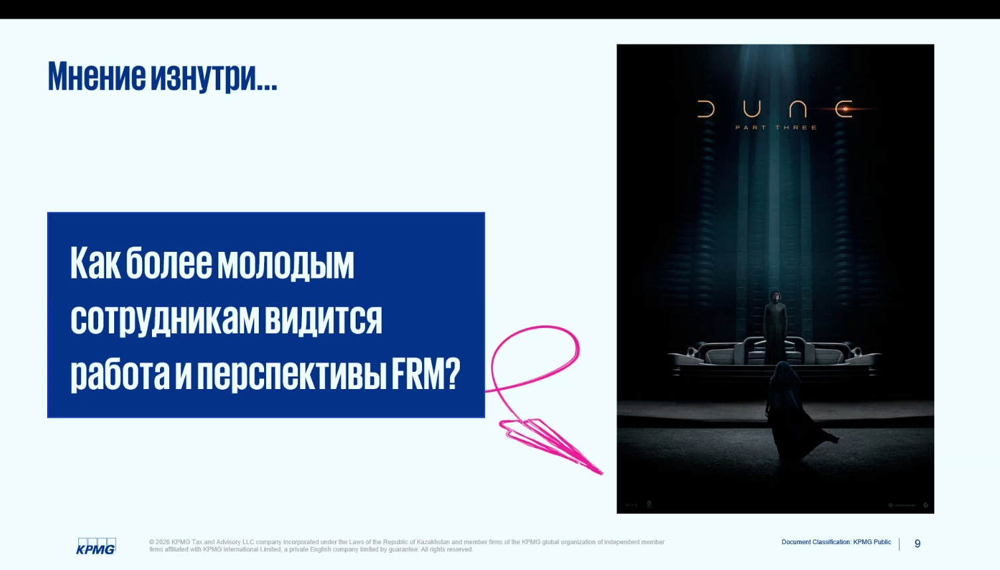
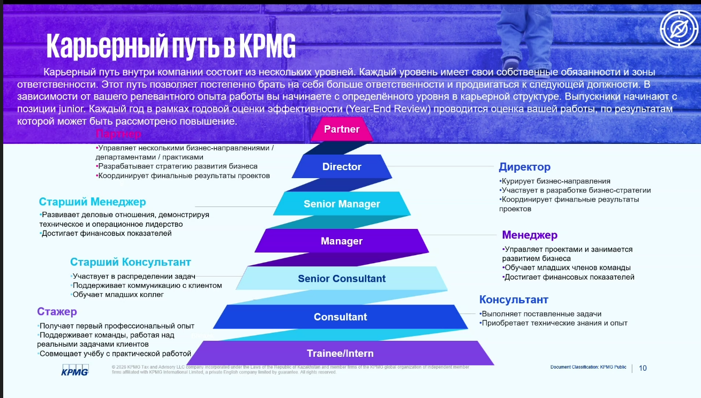
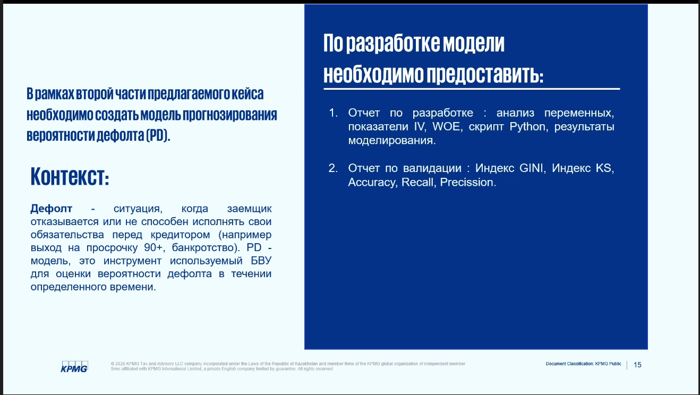
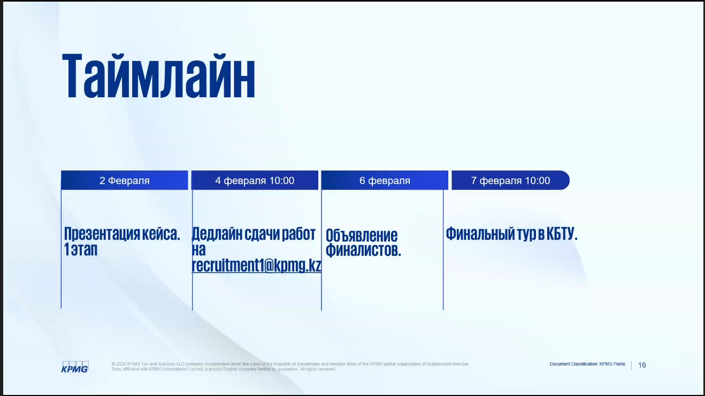

# KBTU-KPMG-2026

## Заметки

Че делают:
метоология оценки
статистические модели
дионостика текущих систем управления рисками
настройка управления рисков

Модели должны быть интерпретируемы, справедливыми

Каким рискам подвержен банк:
---

Увеличивает шансы на стажировку:
---

Что на практике?
---

Как представляют сотрудника
---

*Причем тут дюна?*

- Строить модели кредитных рисков?  (Алишер)
- Для чего строить модели кредитны рисков?
- ...
- определять вид рисков и как уменьшить их негативное влияние на организацию
 
- Чтобы оценить вероятность клиента ухход в дефолт?
 
- В целом правильно, чавствовать в аудиторских мероприятий, статистика математика, помочь оценить бизнесу нашего клиента

- использовать данные для получения ценной информации через статистические модели машинного обучения 

- О, вот правильно
*Че он так долго все это говорил?*

Карьерный путь
---

Вопросы
---
1) Предусмотрены ли летние стажировки для 3-го курса? - Да, рассматривают, если есть возмодность работать фулл тайм

2) Коллега, а заработная плата хорошая? - на уровне big 4

3) На сколько быстро можно продвигатся? - каждый год, но иногда быстрее.

4) Играет ли роль владение сертификатом АССА у Вас? - нет (бета карьеры)

5) Сертификация не играет роли, математика и python ценятся больше
6) Если kpi высокий то какие плюшки могут быть? - *я не понял ответ*. Скидки, спордзалы, и т.д + страховка. Страхование жизни распространяется на личные штуки в том числе. *Ну типичный базар короче был*, за исключением обязательных курсов.

7) В плане графика все демократично (ну конечно, да, верим)

8) Основные алгоритмы: Регрессии, бустинг, случайный лес.
9) Предназначен для ребят, которые будут активно учавствовать в разработке
10) Вам нравится работа? - да, очень нравится Влпооа(невменяемй бред)
11) Хватит базового синтаксиса питона
12) Стекинг использовали, вопрос был у тимура? - Я вот не помню, кажется нет... Big Data было бы не плохо
13) Достаточно на поверхностном уровне, интерпретировать коофициенты, как математически это все работает
14) Люди частно выгорают 
15) Пет проекты роляют
16) GPA не влияет
17) предусмотрена нормальная доза вайб кодинга

Непосредственно Кейс *наконецто*
---

Две части

1) Онлайн дадут датасет
1.1) Прогнозирование дефолта
много пропущеных значени (*Моя идея:*пропущенные значения тоже многое говорят)
1.2) Питон код и презу на выход, ipynb можно
1.3) Будут смотреть на фишки
1.4) Обоснование крайне важно
1.5) feature инж. не нужен, нужен на втором этапе

первый жтап менее хардовый, просто показать идеи, сделать хорошую презу, интерпретация крайне важна. Четких критериев нет, итоговый файл и python код 

Файл для дальнейшего моделирования - Данный в надлежащий вид, имели ввиду что есть данные сырые - подготовить данные к моделированиб

- Есть ли какие-то ограничения по количеству слайдов либо структуры презентации? - Ограничений нет
Ноутбук + pdf
В коде тоже можно обосновать
2) Оффлай разработка модели
Модель прогнозирования вероятности дефолта

2.1) Дополнительные методы валидации будут жирным +

## Таймлайн

## Доплнительно
Не шарят за вайб кодинг
Странные какие то
Желают нам "удачи", всего хорошего
Спасибо до свидания